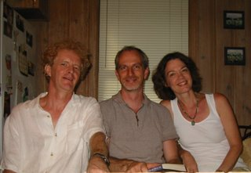

```
Texas miles
Bonar smiles

Bishop Briggs
London digs

Aunts & Uncles
down at Creich

Magic moments
living memories

do not doubt
they're looking out

for you and me
where the river meets the sea
down at Creich
```

Written in Austin, Texas on 27th August 2006 for Iain, after a hot-tub and Glenmorangie inspired memories session 
about Bonar, relations and ancestors and their magic - and whether we wanted to be buried in Creich alongside them or not.

His spontaneous decision to give me the book "No Great Mischief" (which peeps into bottom of this photograph) 
in the hot-tub lead to my reading of it, and it's straightforward approach to explaining relations and child-hood 
memories has inspired me to do the same and they should appear here over time.

Thanks Iain! 