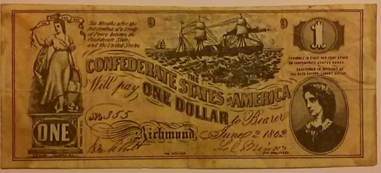

Cleaning out the other day I found this, and felt like sharing it with others.

Given to me years ago when I was young by Lorna, who endured my luring over such collectibles in my youth and 
occasionally took pity on me and gave it one to me. 

This is a Confederate States of America Dollar Bill. During the American Civil War the Southern Confederate States of 
America issued their own currency, and this is one of them. Hence they date from between 1861 and 1865, 
with this one showing June 1862.

Not in too bad condition considering it was just kept lying around, and not by a collector. When I looked on the 
Internet it wasn't as rare, or valuable, as I had imagined. But as I wouldn't sell it anyway, so that doesn't matter.