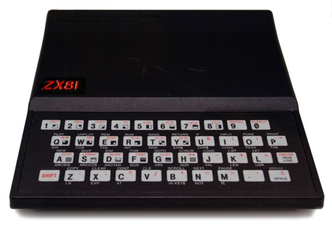
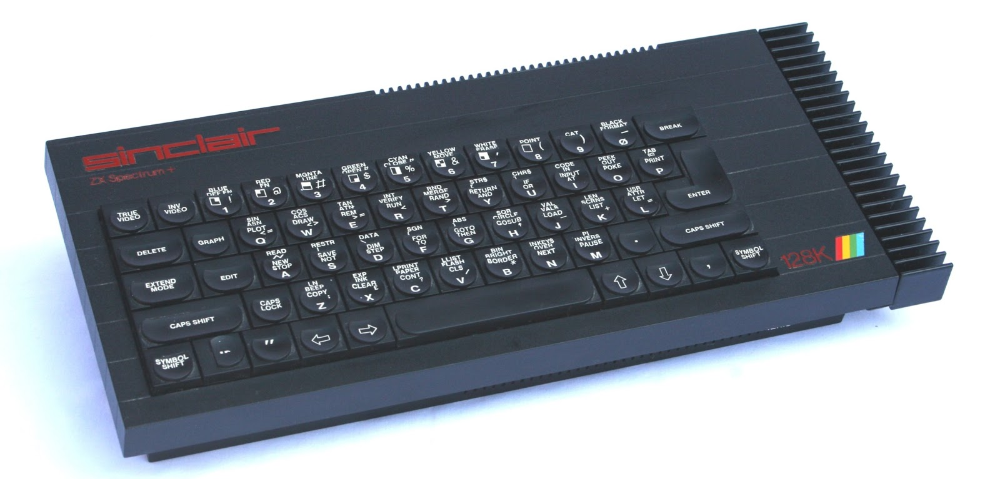
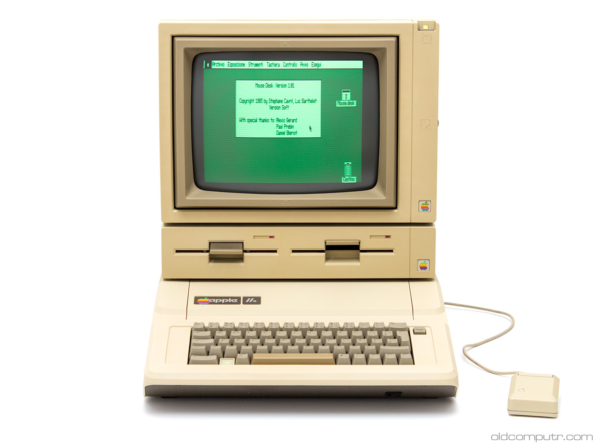

# It was 1984

I was finishing my last year at school and just about to go off to University.

I had already been programming at home for a few years on a
 
 

and then a
 

 
We did some programming in our Maths, then later Computer Studies, classes at high-school.

It was mainly Basic and Pascal on the [Apple IIe](https://en.wikipedia.org/wiki/Apple_IIe)

  
and the [BBC Micro](https://en.wikipedia.org/wiki/BBC_Micro)
 

## The Beeb
The BBC Micro was groundbreaking in it's day. The BBC commissioned the creation of an affordable computer
that folks at home could afford, to follow along to programming classes they would emit on the BBC2 channel
as part of the "Open University" series that was distance learning via terrestrial TV transmissions.

A lot of the classes were transmitted or "aired" at strange off-peak times, and most people would 
video record them and watch them at a reasonable hour - plus the advantage of being able to pause and restart 
them.

You connected "The Beeb" computer to a TV usually to avoid having to buy a monitor.

It had GPIO, and analog inputs and outputs that encouraged extensions and hobby uses of it. It also had a
higher-speed parallel extension interface called "The Tube" that connected to extension boards (over a very wide,
and very colourful ribbon cable!). Extension boards included external processor boards.

The Beeb was used to develop the ARM architecture and the first prototype ARM platforms: 
the ARM Evaluation System and the A500 workstation, functioned as processors attached to The Tube interface.

Around the same time Apple announced the Lisa ((1983 I think).
I drooled over the Lisa, with it's powerful Motorola 68000 processor and graphical interface.
  

  
But it cost en eye watering $10,000 at launch (more in the UK!) and there was no way I was getting one.
  
But for this story, the most important development was that of the Transputer, which I came across shortly after 
starting University, and that could be connected to the BBC Micro via "The Tube" and programmed from the micro.
