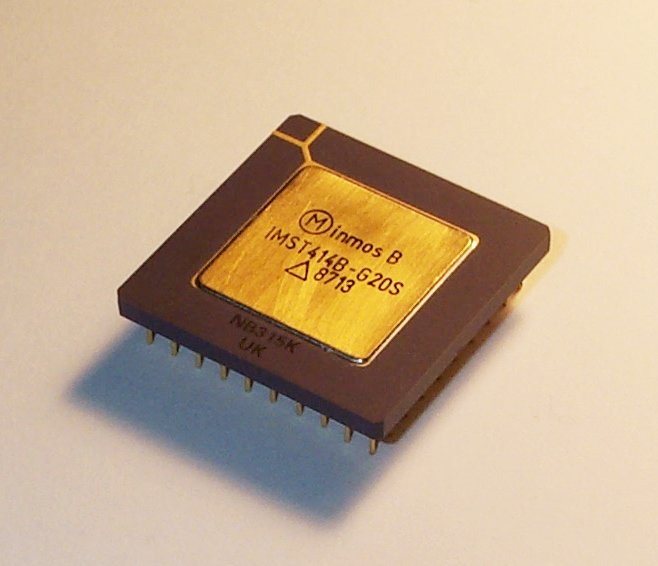

Early in 1984 the UK company INMOS released the innovative [transputer](https://en.wikipedia.org/wiki/Transputer)
_"featuring integrated memory and serial communication links, intended for parallel computing"_

We studied and programmed the transputer at University.

The transputer was designed from the ground-up for parallel computing, both the computing hardware (one of the first SoC), 
the embedded RT-OS that managed IO and instruction scheduling, the Occam programming language 
and the Embedded I/O functions and Inter-chip serial links.

The goal was to make a small, powerful and cheap chip that could be put into virtually any device, using some of
them for I/O and peripheral control, with one or more powerful versions for a processing power.

## Parallel Transputer Hardware
Each transputer had four serial interfaces (or hardware channels) (North, South, East, West) that were used to
connect transputers together in a grid (or other topology if you wanted)

## Occam a parallel processing language
Occam was a programming languages designed for the Transputer and parallel programming, from the grounds up.
Lines of code were formed into blocks, that were either executed sequentially (using a "SEQ" keyword to preface the 
block) or in parallel (using a "PAR" keyword to preface the block).

Parallel processes communicated over logical channels. When deployed for execution, the "network" of parallel 
logical processes the programmer had written was mapped onto the physical topology of parallel Transputers being
used. 

When split across multiple Transputers, the logical channels between processes was mapped onto the physical serial 
links between Transputers (with multiple logical channels being multiplexed onto one physical channel), 
allowing true parallel computing. Data sent was written directly into the "inbox" 
memory of the destination process (using DMA across chips).

When multiple processes were deployed onto one physical Transputer, the logical communication channels were 
implemented in software and concurrent (not parallel) computing resulted, but without any change to the concurrent 
nature of the program execution, and without the need to rewrite any code.

## Transputer IDE
We did development on the BBC Micro, with a transputer board being linked to it via "The Tube" interface.

It came with an "IDE" for Compiling, Linking and deploying Occam programs.
It had a innovative "Folding" editor, that allowed you to fold code blocks down to one line and navigate quickly
 through the code. It could also be used for "after the fact" debugging.

## Summary of things that stuck with me
- design hardware and software together. Hardware can have built in features to aid the software
- parallelism declared explicitly when you wrote the algorithm
- conceptualize the program as a series of parallel processes communicating over channels
- think about the algorithm as a network of communicating processes, and need to pass data from one to the other
(hing, hint... "CSP", we'll talk more about that later)
- hardware topology can be different to the software network design, but the software can be optimally mapped onto 
the topology (at run time)
- Being innovative and doing great engineering doesn't guarantee success :-( 

## Post Data on Transputer death
Arguably the innovations of the Transputer
were lost when Inmos wasn't able to advance the raw processing power enough, during the period of incredible advances 
in semi-conductors (transistor counts and cycle frequencies) applied to "normal" processors (Intel, Motorola, PowerPC etc).

When "normal" processors frequency improvements finally ran out of steam, and they had to start adding cores instead.... the 
innovations of the Transputer and Occam to exploit many parallel cores by a single program were long dead.