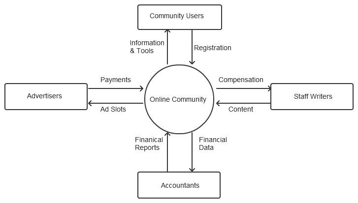
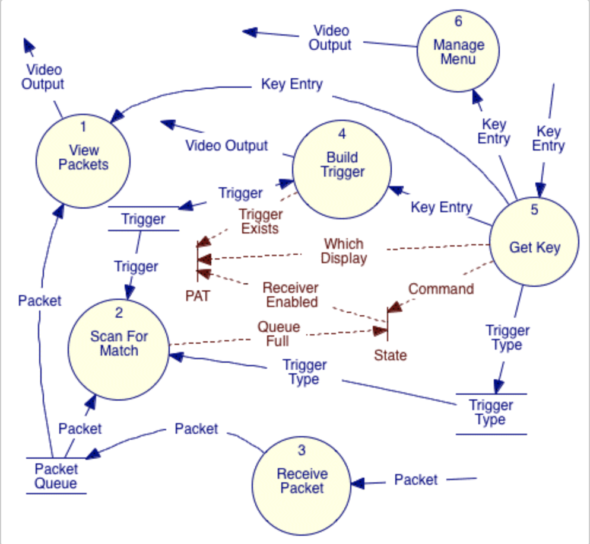

---
layout: post
title: Flow Origins - 1987, Structured Analysis and Design
tags: flow programming
--- 

Ah... the good old days (of Software Development), when you took time to sit down and think about a problem, 
and try and define it, then think on the solution and design it... all _before_ starting to write code.

I was working at Hewlett-Packard, in their Telecommunications Division, making high-speed instruments for other
engineers to use to make high-speed things for you!

I was in my second last year at University, in the "placement in industry" period, where I worked one trimester 
plus the Summer in industry before starting my last year at University.

To help maintain software quality and reliability, HP back then used a formal methodology called 
[Structured Analysis and Design](https://en.wikipedia.org/wiki/Structured_analysis_and_design_technique)

    "Structured analysis and design technique (SADT) is a diagrammatic notation designed specifically to help 
    people describe and understand systems."

## Structured Analysis
For a noob, this was the hardest part to get your head around, partly I think as it forced you to NOT run
headlong into designing the solution, or coding, but to spend considerable time capturing the problem, 
and structuring it using tools that helped check the completeness and consistency of the problem as captured.

It involved by starting defining "The Context" for the System you were about to analyse, design and then implement.
You conceived of it as a top-level "bubble" (i.e. like a black box) and you captured all the external systems it
interacted with and what data flowed to and from your system. Here is an example:

This top-level bubble delimited what you had to analyze, then design and then implement. You then proceeded to a 
hierarchical decomposition of this bubble down into sub-bubbles ("Processes") in Data Flow Diagrams (DFDs)
that represented parts of what _should happen_ 
(i.e. the problem you are trying to solve / what you are trying to implement, not the design for it). These lower
level bubbles produce or consume data, and the sum of that data interchanges must match the data flowing into and
out of the parent bubble. i.e. Data was not lost in the decomposition. 
When you got to a low enough level of detail or complexity of the processes captured you just "stopped". These lower
level Processes were simple enough to understand what they did without further decomposing them. There would be a 
textual description in the lower levels of what they did, sometimes in a psuedo language that any programmer could
understand.

The overall Analysis captured how the system reacted to data 
input, transformed it or created new data and how that flowed "up and out" or "in and down" to the external entities captured 
in the _Context Diagram_. The analysis tools would check the consistency of the the data flow between levels so you
didn't leave anything out.

Here is an example of a DFD, showing _Control_ flows in broken lines and with some data storage (for a different 
system):

At levels below the _Context Diagram_ data could flow between bubbles at the same level in the hierarchy or to others
as long as all the data flowing into and out of a bubble matched with the parent data flows, and the data types
flowing were consistent.

## Summary of things that stuck with me
* The use of a visual, hierarchical  decomposition of functionality required to solve a problem. 
  The analysis did this on the problem and the design of the solution, in different ways. Even though
  it's less implementation focussed, the structured analysis part is what most stuck with me,
  with nested "bubbles" with data flow between them at the same level, to the upper level in hierarchy, 
  and into bubbles that expanded into the next level down. Data in to a level from above had to match
  at the next level up and down.
* Tooling (Software development tools, other than compilers!) that helped you draw out your problem (and the solution
  in the _Structured Design_ part of the methodology) visually, interactively, and that helped you analyze it, capture
  it's complexity in a common language others could (after learning) easily follow and which could help you by
  checking the consistency of the model you captured.
* After a bit of decomposition you quickly ended up with a number of primitive processes that anyone could understand
  and didn't need more analysis or explanation, and they were composited-up in a way other programmers could understand
  and the total represented the unique problem you were analysing and trying to solve.
* The analysis was just the problem description and so shouldn't be thought of in implementation
  terms. Yet I did. There were attempts to automate the translation of a problem captured (using SA) to the design of 
  a solution (using Structured Design notation), but they never seemed to quite make it.
  I wanted to "automate" this, or just "compile" the problem description.
  I liked how it "just worked" (or you could imaging it executing in your head), based on the availability of data 
  flowing between process bubles, and also how it was inherently parallel. The only thing that "sequenced" a process's execution was the 
  availability of data on it's inputs.
* Not implementation focused, as was all about analysing and understanding _the problem_.
  This is not directly applicable to my `flow` project, but I've often gone back to that point over the years
  and made a conscious effort to try to understand a problem well, and be able to describe it (even if in words),
  before trying to solve it. It's tough to not just pick-up an editor and a compiler and dive in (solving a problem
  _is_ the most fun part after all), but if you can resist the temptation for a while it usually pays dividends.